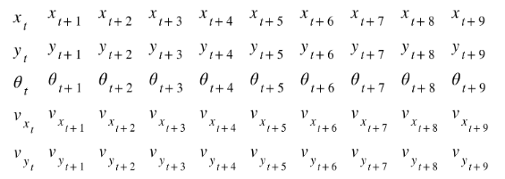
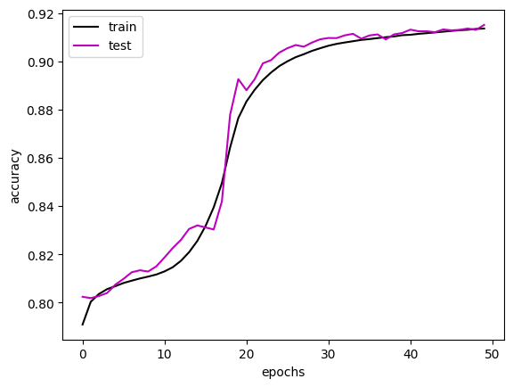
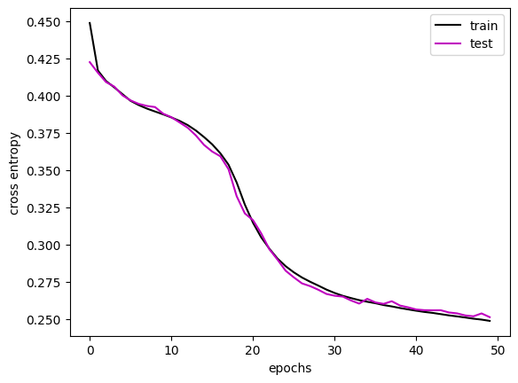
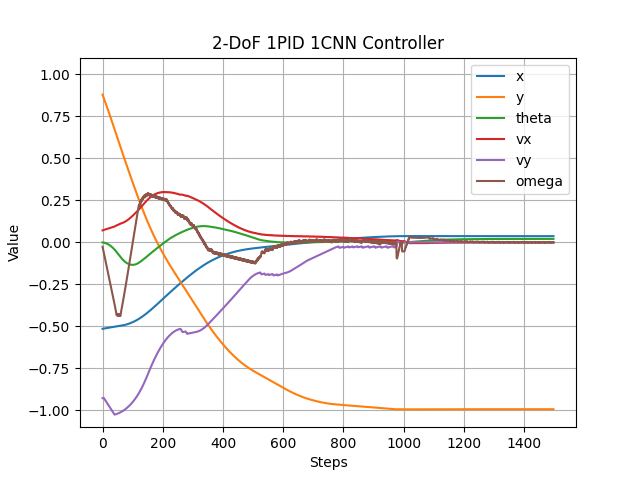
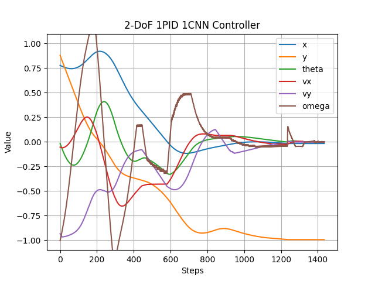

# 2 Degrees-of-Freedom AI Controller
This is a continuation of my previous project which is called 2DoF_PID, which implements a PID controller.<br>
The state-space is x-position, y-position, orientation, x-velocity, y-velocity at each timestep. 
In this implementation of 2DoF AI controller Behavioral Cloning is used to land the rocket using the two action variables (Throttle & Thrusters)<br>
The actions are discrete, ranging from [-1.0, 1.0] with six intervals with a step of size 0.4.<br>
The action_y is responsible for controlling the vertical and horizontal positioning of the rocket
using a 2D Convolutional Neural Network, by cloning the behavior of the expert system i.e. the PID controller. And hence the rocket will be drived toward the center of the platform.
As for the other DoF which is the PIDtheta controller(FOR NOW!) it maintained the rocket to be at equilibrium above the target
point i.e. (0,-1) and if it's not above that point it will tilt the rocket to make it move towards the target point,
the setpoint was {pi/4 * (x + Vx)}. The PIDtheta controller's gain parameters are Kp = 1,000 , Ki = 2.5, Kd = 750.


For more clear demonstrations please refer to this link => https://youtu.be/NsNVTk2JRKE

### The Architecture of the Network:<br>
  ```
  CNN2D(
    (conv_block): Sequential(
      (0): Conv2d(1, 10, kernel_size=(3, 3), stride=(1, 1))
      (1): MaxPool2d(kernel_size=(1, 2), stride=(1, 1), padding=0, dilation=1, ceil_mode=False)
      (2): ReLU()
    )
    (fc_layers): Sequential(
      (0): Linear(in_features=210, out_features=105, bias=True)
      (1): ReLU()
      (2): Linear(in_features=105, out_features=6, bias=True)
    )
  )
  ```
I used the last 10-timestep states as an input to my 2D convolutional neural network, and the label is the last action taken corresponding to the states.<br>
<br><br>
The model's parameters are the followings:<br>
```
epoch_num = 50
batch_size = 256
learning_rate = 0.001
optimizer = "Adam"
loss = "Cross-entropy loss"
```
# The training process:<br>
<br>
<br><br>
<br><br>
Here are the responses of the system, for multiple random landing samples;

<br>
<br>
<br>
