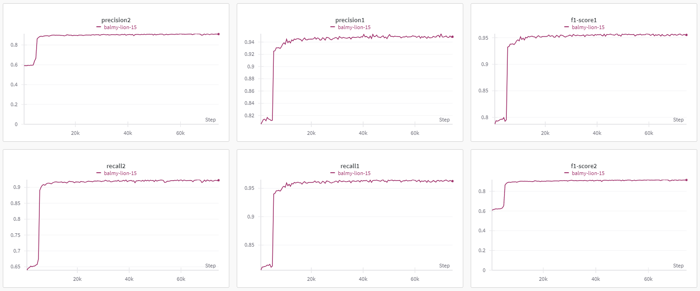
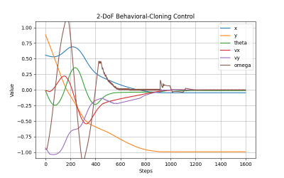
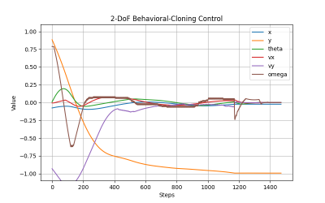

# 2 Degrees-of-Freedom AI Controller
This is a continuation of my previous project which is called 2DoF_PID, which implements a PID controller for a landing rocket in OpenAI's gym environment.<br>
The state-space is x-position, y-position, orientation, x-velocity, y-velocity at each timestep. 
In this implementation of 2DoF AI controller Behavioral Cloning is used to land the rocket using the two action variables (Throttle & Thrusters)<br>
The actions are discrete, ranging from [-1.0, 1.0] with six intervals with a step of size 0.4.<br>
The action_y is responsible for controlling the vertical and horizontal positioning of the rocket, as for the action_theta its responsible for the thrusters.<br>
These actions are learned by 2D Convolutional Neural Network, by cloning the behavior of the expert system i.e. the PID controller's.<br>
therefore the rocket will be navigated toward the center of the levitating platform via action_y.<br>
As for the other DoF which is the controlled by action_theta, it maintained the rocket to be at equilibrium above the target
point i.e. (0,-1) and if it's not above that point it will tilt the rocket to make it move towards the target point,
the setpoint is {pi/4 * (x + Vx)}.

### The Architecture of the Network:<br>
  ```
  CNN2D_2headed(
  (conv_block1): Sequential(
    (0): Conv2d(1, 32, kernel_size=(1, 5), stride=(1, 1))
    (1): ReLU()
  )
  (conv_block2): Sequential(
    (0): Conv2d(32, 128, kernel_size=(1, 4), stride=(1, 1))
    (1): ReLU()
  )
  (conv_block3): Sequential(
    (0): Conv2d(128, 128, kernel_size=(1, 2), stride=(1, 1))
    (1): ReLU()
  )
  (conv_block4): Sequential(
    (0): Conv2d(128, 32, kernel_size=(1, 2), stride=(1, 1))
    (1): ReLU()
  )
  (fc_layers): Sequential(
    (0): Linear(in_features=160, out_features=320, bias=True)
    (1): ReLU()
    (2): Linear(in_features=320, out_features=640, bias=True)
    (3): ReLU()
    (4): Linear(in_features=640, out_features=640, bias=True)
    (5): ReLU()
    (6): Linear(in_features=640, out_features=320, bias=True)
    (7): ReLU()
    (8): Linear(in_features=320, out_features=160, bias=True)
    (9): ReLU()
  )
  (fcl_output1): Linear(in_features=160, out_features=6, bias=True)
  (fcl_output2): Linear(in_features=160, out_features=6, bias=True)
)
  ```
I used the last 10-timestep states as an input to my 2D convolutional neural network, and the label is the last action taken corresponding to the states.<br>
the CNN is of Two-Heads, the first head is responsible for action_y and the other head is responsible for action_theta<br>

## The Training/Testing Process:<br>
The training process is done using training.py file whereby it make use of other functions from other files too.<br>

### Training Set:<br>
The training set is created using the previous project's PID controller. The format of the data is a json file which have each episode number as a key and corresponding to it is the state,action pairs as the value.<br>
One state:<br>
<br><br>

### Hyperparameter Selection:<br>
logged data while training/testing using Wandb => https://wandb.ai/hazemk/BC-MultiHeaded-CNN/workspace?workspace=user-hazemk <br>
For hyperparameter optimization I used Wandb to log my training sessions, and compare each session with the other one, as a result these were an adequate combination:
```
hyperparameters = {
    "architecture": "MultiHeaded-CNN-4",
    "dataset": "episodes_v4_1.json",
    "learning_rate": 0.003,
    "epochs": 150,
    "batch_size": 2048,
    "loss": "Cross-entropy",
    "optimizer": "Adam",
}
```
The model's parameters are the followings:<br>
```
epoch_num = 50
batch_size = 256
learning_rate = 0.001
optimizer = "Adam"
loss = "Cross-entropy loss"
```
### Train Results:<br>
<br>
### Test Results:<br>
<br>
### Performance Metrics:<br>


## Agent in Action:<br>
For video demonstrations please refer to this link => https://youtu.be/gj1ZXEDRhz8

### Agent's Control Responses:<br>
For multiple landings from different initial states:<br>
<br>
<br>
<br>
